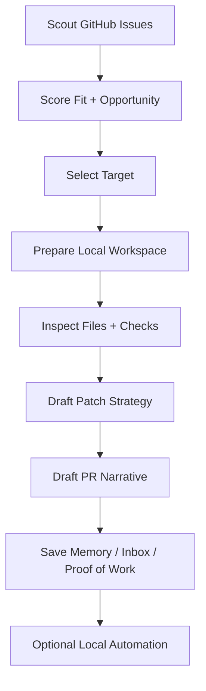

# OpenMeta CLI

<p align="center">
  <a href="./README.md">English</a> |
  <a href="./README.zh-CN.md">简体中文</a>
</p>

<p align="center">
  <strong>Turn open-source ambition into a repeatable contribution system.</strong>
</p>

<p align="center">
  OpenMeta CLI is a local-first autonomous contribution agent that helps developers discover worthwhile GitHub issues, prepare repository context, draft implementation plans, and compound contribution momentum over time.
</p>

<p align="center">
  <a href="#overview">Overview</a> |
  <a href="#features">Features</a> |
  <a href="#quick-start">Quick Start</a> |
  <a href="#command-reference">Commands</a> |
  <a href="#roadmap">Roadmap</a> |
  <a href="#contributing">Contributing</a>
</p>

<p align="center">
  
  
  
  
</p>

## Overview

Open source work usually breaks down long before code is written.

The real friction is often:

- deciding what to work on
- filtering noise from genuinely promising issues
- entering unfamiliar repositories quickly
- rebuilding context from scratch every time
- losing continuity between one contribution and the next

OpenMeta CLI is designed to reduce that friction and turn contribution work into a system instead of a one-off burst of energy.

It combines:

- issue discovery and ranking
- repository-aware workspace preparation
- patch and PR draft generation
- durable contribution artifacts
- local automation for recurring execution

## Why OpenMeta

### Built for contribution throughput

OpenMeta is not just an issue recommender. It is designed around the full path from opportunity discovery to contribution-ready artifacts.

### Local-first by default

State, workspace preparation, memory, and generated artifacts stay local. The only remote services involved are the GitHub and LLM APIs you explicitly configure.

### Designed to compound

Each run can improve the next one through repo memory, inbox state, and proof-of-work records. The system is meant to get more useful over time.

## Features

### Opportunity scoring

OpenMeta ranks GitHub issues against your technical profile using signals such as:

- stack fit
- freshness
- onboarding clarity
- merge potential
- repository impact

### Repository-aware workspace preparation

Once an opportunity is selected, OpenMeta can:

- prepare a local workspace
- detect likely files
- extract useful snippets
- detect runnable validation commands
- carry repository memory into the next decision step

### Draft generation

OpenMeta can generate:

- patch drafts
- PR drafts
- contribution dossiers
- inbox entries
- proof-of-work records

### Durable contribution state

OpenMeta preserves:

- repo memory
- recent issue outcomes
- preferred file paths
- artifact history
- proof-of-work logs

### Local automation

OpenMeta can install and manage a local daily automation workflow:

- `launchd` on macOS
- `cron` on Linux
- manual fallback on unsupported platforms

## Workflow



## Architecture

Current project layout:

```text
src/
  cli.ts              # entrypoint
  commands/           # command wiring
  contracts/          # structured agent contracts
  infra/              # config, logger, prompts, helpers
  orchestration/      # init, agent, config, automation flows
  services/           # github, llm, workspace, memory, scheduler
  types/              # shared config and domain types
test/                 # Bun test suite
bin/                  # built CLI output
```

## Requirements

- Bun 1.0+
- Git
- GitHub Personal Access Token
- An LLM API key

Supported LLM options currently include:

- OpenAI
- MiniMax
- Kimi (Moonshot AI)
- GLM (Zhipu AI)
- Custom OpenAI-compatible endpoints

## Installation

Install dependencies:

```bash
bun install
```

Build the CLI:

```bash
bun run build
```

Create a global `openmeta` command on Linux or macOS:

```bash
ln -sf "$(pwd)/bin/openmeta.js" /usr/local/bin/openmeta
chmod +x ./bin/openmeta.js
hash -r
```

Verify the installation:

```bash
openmeta --help
```

## Quick Start

Initialize configuration:

```bash
openmeta init
```

Run the autonomous contribution workflow:

```bash
openmeta agent
```

Scout only:

```bash
openmeta scout --limit 10
```

Inspect durable artifacts:

```bash
openmeta inbox
openmeta pow
```

Review configuration:

```bash
openmeta config view
```

If you prefer not to create a global symlink, you can still run the built file directly:

```bash
./bin/openmeta.js init
./bin/openmeta.js agent --run-checks
./bin/openmeta.js automation status
```

## Command Reference

| Command | Description |
| --- | --- |
| `openmeta init` | Initialize OpenMeta CLI configuration |
| `openmeta agent` | Run the autonomous contribution workflow |
| `openmeta agent --headless` | Run unattended using saved automation defaults |
| `openmeta agent --run-checks` | Execute detected baseline validation commands |
| `openmeta daily` | Compatibility alias for `agent` |
| `openmeta scout --limit <count>` | Rank the highest-value contribution opportunities |
| `openmeta inbox` | Show drafted contribution opportunities |
| `openmeta pow` | Show proof-of-work history |
| `openmeta runs` | Show recent command runs, durations, and failure reasons |
| `openmeta runs <id>` | Inspect one recorded run |
| `openmeta provider list` | List saved LLM provider profiles |
| `openmeta provider config` | Configure a provider profile interactively |
| `openmeta provider save <name>` | Save current LLM settings as a reusable provider profile |
| `openmeta provider add <name>` | Add a provider profile from command-line values |
| `openmeta provider use <name>` | Switch the active LLM provider to a saved profile |
| `openmeta provider remove <name>` | Remove a saved provider profile |
| `openmeta automation status` | Show automation state |
| `openmeta automation enable` | Enable unattended daily automation using saved settings |
| `openmeta automation disable` | Disable unattended daily automation and remove the system scheduler |
| `openmeta config view` | Show current configuration |
| `openmeta config set <key> <value>` | Set a configuration value |
| `openmeta config reset` | Reset configuration to defaults |

## Local Paths

OpenMeta maintains a clear local footprint:

- config: `~/.config/openmeta/config.json`
- workspaces: `~/.openmeta/workspaces`
- artifacts: `~/.openmeta/artifacts`
- repo memory and proof-of-work state: stored in the local OpenMeta state area

## Security Model

OpenMeta is built around user-controlled execution:

- GitHub PAT and LLM API keys are stored with AES encryption
- no OpenMeta-hosted backend is required
- only explicitly configured GitHub and LLM services are contacted
- unattended automation is opt-in

## Validation

Typical local verification commands:

```bash
bun x tsc --noEmit
bun test
bun run build
```

## Roadmap

Planned or actively evolving areas include:

- stronger real-PR publishing flows
- richer repository memory and quick-win scanning
- deeper provider coverage for OpenAI-compatible ecosystems
- more robust unattended automation and recovery behavior
- improved artifact publishing and contribution traceability

## Contributing

Contributions are welcome.

Good contribution areas include:

- improving issue ranking and repo memory quality
- expanding provider support
- strengthening workspace preparation and validation logic
- refining automation and artifact publishing flows
- improving documentation and onboarding

Suggested local workflow:

```bash
git checkout -b feat/your-change
bun install
bun x tsc --noEmit
bun test
```

## License

MIT
