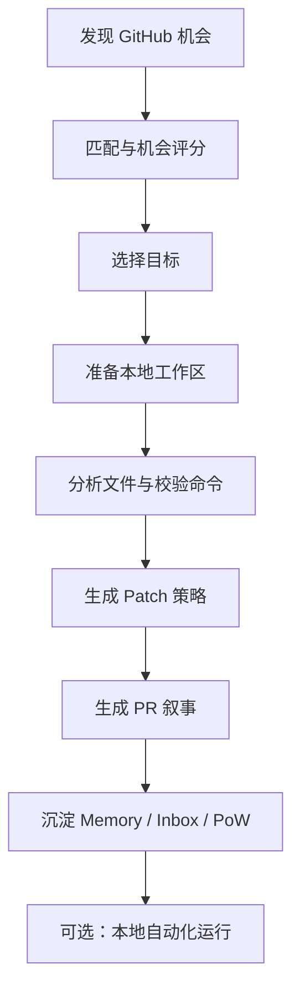

# OpenMeta CLI

<p align="center">
  <a href="./README.md">English</a> |
  <a href="./README.zh-CN.md">简体中文</a>
</p>

<p align="center">
  <strong>把开源参与，从一时兴起变成可重复、可积累的贡献系统。</strong>
</p>

<p align="center">
  OpenMeta CLI 是一个 local-first 的自治贡献 Agent，帮助开发者发现更值得投入的 GitHub 机会、准备仓库上下文、生成实现草案，并持续积累贡献动能。
</p>

<p align="center">
  <a href="#概览">概览</a> |
  <a href="#核心能力">核心能力</a> |
  <a href="#快速开始">快速开始</a> |
  <a href="#命令参考">命令参考</a> |
  <a href="#路线图">路线图</a> |
  <a href="#参与贡献">参与贡献</a>
</p>

<p align="center">
  
  
  
  
</p>

## 概览

很多开源贡献在真正写代码之前就中断了。

真正的阻力通常来自：

- 今天该做什么
- issue 很多，但很难判断哪个值得投入
- 陌生仓库上手成本高
- 每次都要重新建立上下文
- 一次贡献结束后，很难形成连续积累

OpenMeta CLI 的目标，就是把这些高摩擦、重复性的前置动作，整理成一个可持续运行的贡献系统，而不是一次性的灵感驱动行为。

它把这些能力串在一起：

- issue 发现与机会排序
- 面向仓库上下文的工作区准备
- patch / PR 草稿生成
- 持久化的贡献资产
- 本地自动化执行

## 为什么是 OpenMeta

### 面向真实贡献产出

OpenMeta 不只是一个 issue 推荐器。它更关注从“发现机会”到“形成可提交产物”的完整路径。

### Local-first

状态、工作区准备、记忆、产物沉淀都保留在本地。你只需要显式配置 GitHub 和 LLM 服务，不依赖额外的托管后端。

### 会随着使用而变强

随着 repo memory、inbox、proof-of-work 的积累，每一次运行都可能让下一次贡献变得更快、更稳。

## 核心能力

### Opportunity Scoring

OpenMeta 会结合你的技术画像，对 GitHub issue 进行综合评分，考量因素包括：

- 技术匹配度
- 新鲜度
- 上手清晰度
- 合并潜力
- 仓库影响力

### 面向仓库上下文的工作区准备

选定机会后，OpenMeta 可以：

- 准备本地工作区
- 识别更可能相关的文件
- 提取关键代码片段
- 探测可运行的校验命令
- 将仓库记忆带入后续决策

### 草稿与产物生成

OpenMeta 可以生成：

- patch drafts
- PR drafts
- contribution dossiers
- inbox entries
- proof-of-work records

### 持久化贡献状态

OpenMeta 会持续保留：

- repo memory
- 最近 issue 处理结果
- 偏好文件路径
- 历史产物记录
- proof-of-work 日志

### 本地自动化

OpenMeta 支持本地每日自动化执行：

- macOS 上使用 `launchd`
- Linux 上使用 `cron`
- 不支持的平台走 manual fallback

## 工作流



## 项目结构

当前目录结构如下：

```text
src/
  cli.ts              # CLI 入口
  commands/           # 命令层
  contracts/          # 结构化 agent 合约
  infra/              # 配置、日志、交互、基础设施
  orchestration/      # init、agent、config、automation 编排
  services/           # github、llm、workspace、memory、scheduler 等服务
  types/              # 共享类型定义
test/                 # Bun 测试
bin/                  # 构建后的 CLI 输出
```

## 环境要求

- Bun 1.0+
- Git
- GitHub Personal Access Token
- 一个可用的 LLM API Key

当前支持的 LLM 选项包括：

- OpenAI
- MiniMax
- Kimi（Moonshot AI）
- GLM（Zhipu AI）
- 自定义 OpenAI-compatible endpoint

## 安装

安装依赖：

```bash
bun install
```

直接从源码运行：

```bash
bun run ./src/cli.ts --help
```

构建 CLI：

```bash
bun run build
./bin/openmeta.js --help
```

## 快速开始

初始化配置：

```bash
bun run ./src/cli.ts init
```

运行自治贡献主流程：

```bash
bun run ./src/cli.ts agent
```

仅进行 scouting：

```bash
bun run ./src/cli.ts scout --limit 10
```

查看沉淀产物：

```bash
bun run ./src/cli.ts inbox
bun run ./src/cli.ts pow
```

查看配置：

```bash
bun run ./src/cli.ts config view
```

如果你已经构建过二进制：

```bash
./bin/openmeta.js init
./bin/openmeta.js agent --run-checks
./bin/openmeta.js automation status
```

## 命令参考

| 命令 | 说明 |
| --- | --- |
| `openmeta init` | 交互式初始化 GitHub、LLM、画像、目标仓库和自动化配置 |
| `openmeta agent` | 运行自治贡献主流程 |
| `openmeta agent --headless` | 使用已保存默认配置进行无人值守执行 |
| `openmeta agent --run-checks` | 执行检测到的基础校验命令 |
| `openmeta daily` | `agent` 的兼容别名 |
| `openmeta scout --limit <count>` | 查看机会排序结果 |
| `openmeta inbox` | 查看已起草的贡献机会 |
| `openmeta pow` | 查看 proof-of-work 历史 |
| `openmeta automation status` | 查看自动化状态 |
| `openmeta automation enable` | 启用每日自动化 |
| `openmeta automation disable` | 关闭每日自动化 |
| `openmeta config view` | 查看当前配置 |
| `openmeta config set <key> <value>` | 修改配置项 |
| `openmeta config reset` | 重置配置 |

## 本地路径

OpenMeta 会维护一组清晰的本地路径：

- config: `~/.config/openmeta/config.json`
- workspaces: `~/.openmeta/workspaces`
- artifacts: `~/.openmeta/artifacts`
- repo memory 与 proof-of-work 状态：位于本地 OpenMeta 状态空间

## 安全模型

OpenMeta 强调用户可控的执行模型：

- GitHub PAT 与 LLM API Key 采用 AES 加密存储
- 不依赖 OpenMeta 自建托管后端
- 只访问你显式配置的 GitHub 与 LLM 服务
- 无人值守自动化是明确 opt-in 的

## 本地验证

推荐的本地验证命令：

```bash
bun x tsc --noEmit
bun test
bun run build
```

## 路线图

当前值得继续加强的方向包括：

- 更完整的 real-PR 发布链路
- 更强的 repo memory 与 quick-win 扫描能力
- 更丰富的 OpenAI-compatible provider 支持
- 更稳健的无人值守自动化与失败恢复
- 更强的 artifact 发布与贡献可追踪性

## 参与贡献

欢迎贡献。

比较适合参与的方向包括：

- 优化 issue ranking 与 repo memory
- 扩展 provider 支持
- 增强 workspace preparation 与 validation 逻辑
- 改进 automation 与 artifact publishing
- 完善文档与 onboarding 体验

建议的本地开发流程：

```bash
git checkout -b feat/your-change
bun install
bun x tsc --noEmit
bun test
```

## License

MIT
